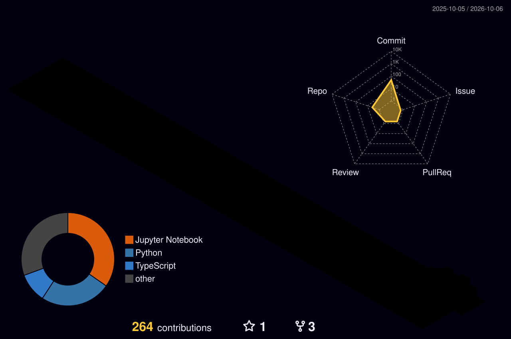

**B.Tech CSE (AI & ML) @ Bennett University**

## ✿ About Me

I'm a final-year Computer Science Engineering student specialising in **AI & Machine Learning**.

I enjoy building products that combine **AI, software engineering and user experience**, especially where technology can solve a real problem rather than just exist as a demo.

## ♡ Tech Stack

## ✧ Highlights

- 🤖 **R&D Co-Head, Technotix Robotics Club** — mentored 10+ technical teams
- 🌍 **Deputy Minister, International Relations** — coordinated 3+ academic collaborations
- 🏅 **Smart India Hackathon 2023** — ranked **#47 among 10,000+ teams**

## ☁ Contribution Map

## 🎧 Currently Vibing To

## ✿ GitHub

## 🐍 Contribution Snake

<picture>
  <source media="(prefers-color-scheme: dark)" srcset="https://raw.githubusercontent.com/nidhi752/nidhi752/output/github-contribution-grid-snake-dark.svg">
  <source media="(prefers-color-scheme: light)" srcset="https://raw.githubusercontent.com/nidhi752/nidhi752/output/github-contribution-grid-snake.svg">
  
</picture>

## ✧ Open Source

### `build → learn → improve → ship`

### ♡ `idea → code → bug → fix → ship`

